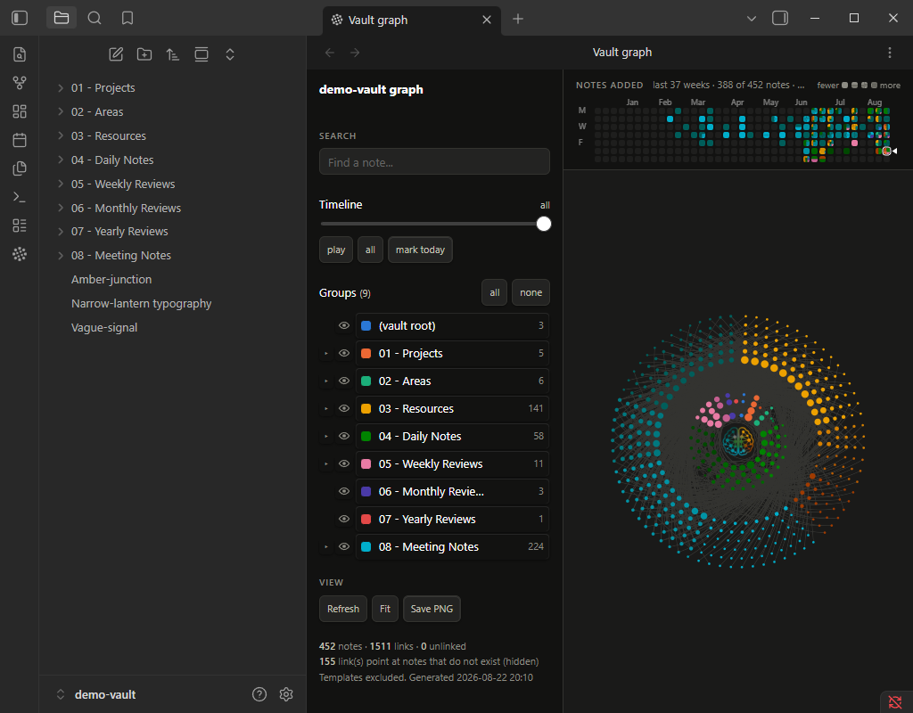
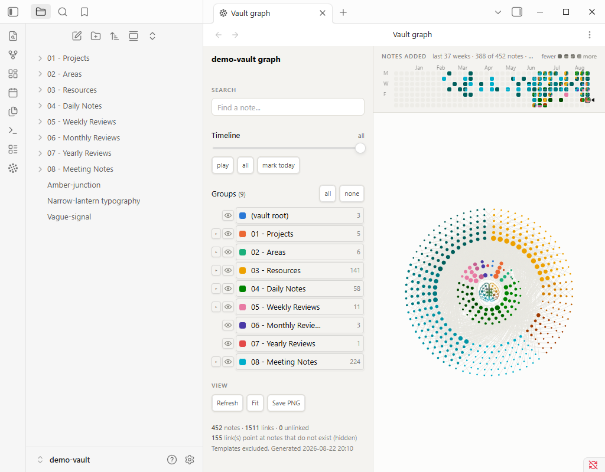
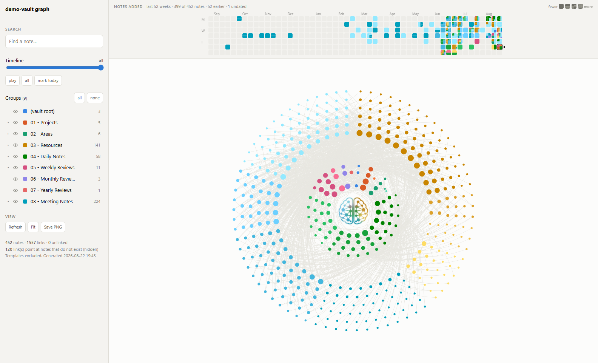

# Vault Graph

**Your whole vault as one disc.** Every note is a dot; every top-level folder owns a wedge
of the circle whose angle is its share of the vault. Notes fill concentric rings from the
middle outwards, best-connected first, so hubs sit near the hub and leaves land on the rim.

The layout is **deterministic, not force-directed**. There is no simulation to settle and
no seed to get lucky with: the same vault always draws the same picture, so the shape
becomes something you can learn and recognise rather than a fresh tangle each time.



Ships as an **Obsidian plugin** and as a **standalone HTML exporter** — one page, two
mounts, from the same source. The exporter writes a single self-contained offline file with
no server and no network, which is how the graph reaches a phone.

---

## What it does

**The disc**
- One wedge per top-level folder, sized by how much of the vault it holds; subfolders take
  their parent's hue at a lighter tint and cut sub-wedges inside it.
- Node size follows link count, so hubs are visibly hubs.
- Two bands — an inner ring and an outer ring — assigned once and kept stable, so hiding
  something in one ring never re-packs the other.
- Links are curved away from the hub by default, because only ~9% of links stay inside one
  folder and straight chords would draw a grey wash across the middle. There is a switch.

**Filtering, and what it does to the layout**
- Click any folder or subfolder in the legend to hide it. The remaining wedges **grow back
  into the angle it vacated** and the whole disc re-packs — the layout is a statement about
  what is currently visible, not a fixed seating plan with gaps in it.
- Solo a folder, hide everything, bring it all back.
- Search narrows to matching notes and lists the hits.

**Time**
- A **heatmap band** above the disc: one square per day, coloured from the notes that landed
  in it, so a busy week is both taller and more colourful.
- A **timeline** slider replays the vault's growth from its first note to today. `play`
  animates it.
- `mark today` haloes everything created today without moving anything.

**Reading one note**
- Hover a note to raise it and dim everything unconnected to it.
- Click for a panel: folder, type, tags, word count, and its linked notes — click any of
  them to jump across the disc.
- In the plugin, **Open in Obsidian** opens the note in a pane.

**Themes**
- Follows Obsidian's theme, including a live switch.



---

## Install the plugin

**From Obsidian** — Settings → Community plugins → Browse → "Vault Graph" → Install, then
Enable. Open it from the ribbon icon or the command palette (*Vault graph: Open the graph*).

**Manually** — download `main.js`, `manifest.json` and `styles.css` from the
[latest release](https://github.com/luke321/vault-graph/releases/latest) into
`<vault>/.obsidian/plugins/vault-graph/`, then reload plugins and enable it.

**From source** — `npm install && npm run build`, then `./scripts/install-plugin.ps1`.

It reads your vault through Obsidian's own metadata cache, so it sees the same links
Obsidian does, aliases and frontmatter links included. It builds in about a tenth of a
second on a 450-note vault. **Nothing leaves your machine** — no network, no telemetry, no
account.

---

## Or export a standalone page

The other half of the same source: one HTML file, openable offline on anything with a
browser.



### Getting the exporter

**Requirements: Node 18 or newer. That is the whole list.** No `npm install`, no network
access, no build tooling.

**This is not an app you run — it is a generator.** The script reads your vault once and
writes **one HTML file**. Nothing is listening afterwards; you open that file yourself, in
any browser, like any other file on your disk. Two steps, and the second one is yours.

### 1. Get it

Download the latest [**release**](../../releases/latest) — every tagged version has a
`vault-graph-<version>.zip` attached with everything needed to run, so a tag is always a
downloadable build rather than just a source snapshot — and unzip it. Or clone, if you want
the design records and the dev tooling too:

```bash
git clone https://github.com/luke321/vault-graph.git
cd vault-graph
```

### 2. Generate the file

```bash
node src/build-graph.mjs --vault "/path/to/your/vault"
```

It reads the vault, writes the HTML, prints where it went, and exits:

```
vault-graph: 449 notes, 1489 links, 0 orphans, 120 unresolved link(s)
wrote /path/to/your/vault/03 - Resources/Vault Graph/vault-graph.html (732 KB)
```

### 3. Open that file

That path in the last line **is the graph**. Open it however you open any local file —
double-click it, or:

```bash
start "path/to/vault-graph.html"      # Windows (cmd)
open "path/to/vault-graph.html"       # macOS
xdg-open "path/to/vault-graph.html"   # Linux
```

No server, no `localhost`, no watch mode, and nothing left running when the script exits.
The page is a **snapshot** of the vault as it was when you generated it: to see notes you
have added since, run step 2 again and reload the tab. (The Refresh button *inside* the
page resets the filters and replays the intro — it cannot re-read your vault, because a
`file://` page is not allowed to.)

## Read this before sharing the output

The generated HTML **contains the structure of your vault in plain text**: every note's
title, its path, its folder, its tags, its `created`/`date` frontmatter, its word count,
and the link graph between notes.

It does **not** contain note bodies. Nothing you wrote inside a note is in the file.

That distinction matters the moment you think about sharing. A screenshot is usually fine.
Handing someone the HTML hands them **a complete listing of your note titles**, which for
most vaults is more revealing than it sounds. The file is designed to live inside your own
vault and sync to your own devices; treat it as private by default. There is no anonymise
mode.

## Which vault

You can skip `--vault` entirely. Resolution order, first match wins:

| | source |
|---|---|
| 1 | `--vault <path>` — explicit, always wins |
| 2 | `VAULT_GRAPH_VAULT` — per-machine override without editing anything |
| 3 | `OBSIDIAN_VAULT` — the machine-wide answer other tooling can share |
| 4 | `--vault-name <name>` — pick from Obsidian's registry by folder name |
| 5 | **Obsidian's own registry** — the only entry, or the one currently open |
| 6 | walk up for `.obsidian` — so dropping this folder inside a vault works |

With one registered vault, `node src/build-graph.mjs` on its own works. With several and
none unambiguously open, it lists them and stops rather than guessing. Errors name which
source supplied a bad path.

Registry: `%APPDATA%\obsidian\obsidian.json` (Windows),
`~/Library/Application Support/obsidian/obsidian.json` (macOS),
`~/.config/obsidian/obsidian.json` (Linux).

## Where the output goes

```
<this repo>/                              source: template, build script, vendored libs
  └─ .ai-context/                         architecture + decision records
<vault>/03 - Resources/Vault Graph/       ...or anywhere: --out FILE
  ├─ vault-graph.html                     build output, opened directly in a browser
  └─ Vault Graph.md                       optional stub note so [[Vault Graph]] resolves
```

That default path is the **PARA convention of the vault this was written for**, not a
requirement — `--out` puts the file wherever you like:

```bash
node src/build-graph.mjs --out ~/Desktop/my-vault.html
```

Writing it *into* the vault is the default for one reason: the vault already syncs to your
phone and your other machines, and one self-contained file rides along for free.

## Flags

| Flag | Effect |
|---|---|
| `--vault PATH` | which vault to read |
| `--vault-name NAME` | pick a registered vault by folder name |
| `--out FILE` | write somewhere else |
| `--ghosts` | also show `[[links]]` pointing at notes that don't exist yet |
| `--templates` | include your template notes (off by default: their placeholder links are fake edges) |
| `--flat-months` | fold `2026-08` month folders into their parent instead of treating them as a level |
| `--no-nav` | ignore the daily-note prev/next nav line |

## Platform notes

**The builder is cross-platform** — plain Node, no shell-outs. The `scripts/*.ps1` helpers
are Windows-only conveniences, not requirements:

| script | what it does | elsewhere |
|---|---|---|
| `refresh-graph.ps1` | rebuild *and* open | `node src/build-graph.mjs && open <path>` |
| `record-demo.ps1` | record the demo to mp4 | not ported — needs `avfoundation` / `x11grab` |
| `make-gif.ps1` | encode a take as the README GIF | works anywhere ffmpeg does, if you port the wrapper |
| `cursor.ps1` | moves the OS pointer during a recording | not ported |
| `make-logo.ps1` | rebuild the logo mask from source art | not ported; `assets/` is prebuilt |

`scripts/smoke.mjs`, `scripts/demo.mjs` and `scripts/make-test-vault.mjs` are Node and
should work anywhere Chrome does, though only Windows has been exercised.

## How your vault is interpreted

Nothing about a particular vault is hardcoded, but a few conventions are **detected** — and
knowing them explains the output:

- **Top-level folders become wedges**, angle proportional to share. Any folder scheme
  works; PARA is just what it was built against.
- **One level of subfolders is drawn**, as tints of the parent's colour. The three largest
  get their own tint; the rest share a pooled one.
- **Date-named folders** (`2026`, `2026-06`, `2026-Q3`, `2026-W34`) say *when* a note was
  filed rather than what it is — kept at the first level, ignored deeper down.
- **Templates and daily notes come from your `.obsidian` config** (`templates.json`,
  `daily-notes.json`, Templater's settings), not from folder names. Rename them freely.
- **Links resolve the way Obsidian resolves them** — basename, then alias, then full path —
  read from **both** body and frontmatter, so `person: "[[Ada Lovelace]]"` counts. Fenced
  code blocks are skipped so Dataview queries don't invent edges.
- **`created` frontmatter drives the timeline and the heatmap**, falling back to `date`. A
  note with neither is always present rather than stranded at one end of the timeline.
- The daily-note `[[prev]] | [[next]]` nav line **does** count as links; `--no-nav` strips
  it.

A vault with no subfolders, no dates and no aliases still renders — you just get a simpler
disc.

## The page is a snapshot

**It cannot regenerate itself.** The vault is baked in at build time; there is no server,
no network, and `fetch()` is blocked on `file://`, so nothing in the browser can walk your
vault. Re-run the build to make it current.

**The in-page Refresh button is not that.** It resets every filter and replays the intro.
If you have just rebuilt, reload the browser tab.

## Optional: the scripted demo

`?demo` on the URL arms a walkthrough that drives the real controls over Chrome's DevTools
protocol. The storyboard is `demoMode()` in `src/template.html` — append beats to it and
nothing else needs changing.

```powershell
.\scripts\record-demo.ps1        # needs ffmpeg: winget install Gyan.FFmpeg
```

> **It takes your mouse.** With `--cursor` (which the recorder passes) the demo moves the
> real OS pointer so the recording has a visible cursor. For its ~30 seconds the mouse is
> not yours. Leave `--cursor` off and you lose only the visible arrow.

## Optional: the invariant suite

```bash
node scripts/smoke.mjs
```

Builds to a temp file, drives a real Chrome, and checks 16 measured properties of the
layout — plan parity, the resting lattice, the heatmap's tiling, the hover and highlight
ramps — printing the number it measured for each. `--vault PATH` points it at a different
vault (`--url FILE` at an already-built page), which is worth doing: a small vault and a
large one take different branches through the ring balancer and the gap scaling.

```bash
node scripts/smoke.mjs --vault ./test-vault
```

Exits non-zero, so it can gate a push:

```bash
git config core.hooksPath .githooks
```

`SKIP_SMOKE=1 git push` skips it.

## Optional: a test vault

Your vault is one shape. To develop against others:

```bash
node scripts/make-test-vault.mjs --notes 5000
node src/build-graph.mjs --vault ./test-vault --out ./test-vault/graph.html
```

Generates a deterministic synthetic vault — more top-level folders than there are colour
slots, sliver folders beside a dominant one, five levels of nesting, date-named folders,
notes with no frontmatter and no links. `test-vault/` is gitignored.

## Troubleshooting

**"several vaults registered"** — pass `--vault` or `--vault-name`.

**Blank page, or stuck on "Laying out graph…"** — open the browser console; the whole app
is one inlined script, so a thrown error there is the cause. Serving over http rather than
`file://` makes some browser tooling behave: `python -m http.server 8765`.

**The graph looks nothing like my folder structure** — that is the point rather than a bug.
On the vault this was built for, only ~9% of links stay inside a single top-level folder.
The wedges are the filing system; the edges are the actual structure.

**"N links point at notes that do not exist"** — wikilinks whose target is missing.
`--ghosts` renders them, so you can see what your vault reaches for.

## Files

| | |
|---|---|
| `src/build-graph.mjs` | crawls the vault, resolves links, emits one HTML file |
| `src/template.html` | the whole app — layout, render, interaction |
| `vendor/` | Sigma.js + graphology, committed rather than installed |
| `scripts/` | build/open, demo, recording, invariant suite, test-vault generator |
| `.ai-context/` | architecture, invariants, and one record per decision |
| `CHANGELOG.md` | what shipped, per release |

## Licence

MIT — see [LICENSE](LICENSE). The bundled libraries in `vendor/` are MIT too and are
inlined into every build; their notices are in [`vendor/NOTICE.md`](vendor/NOTICE.md) and
must be preserved in redistributions.

## Design notes

Rationale lives in [`.ai-context/`](.ai-context/) — architecture, the measured invariants
with the command that checks each one, and one record per decision that cost something to
learn. **Read the relevant one before changing that part of the disc**: several constants
look arbitrary and are not.

| | |
|---|---|
| [`architecture.md`](.ai-context/architecture.md) | the four stages, and where each decision is enforced |
| [`invariants.md`](.ai-context/invariants.md) | what must not regress, and the command that checks it |
| [`decisions/`](.ai-context/decisions/) | choices with alternatives weighed — why *not* the other thing |
| [`design/`](.ai-context/design/) | how each part actually works, and the measurements behind it |
| [`changelog-detail.md`](.ai-context/changelog-detail.md) | every change with its before/after numbers |

The recurring failure mode here is reasoning about the code instead of measuring it. Serve
the built page and use `__vg.checkPlanParity()`, `__vg.probe()` — or just run
`scripts/smoke.mjs`.
