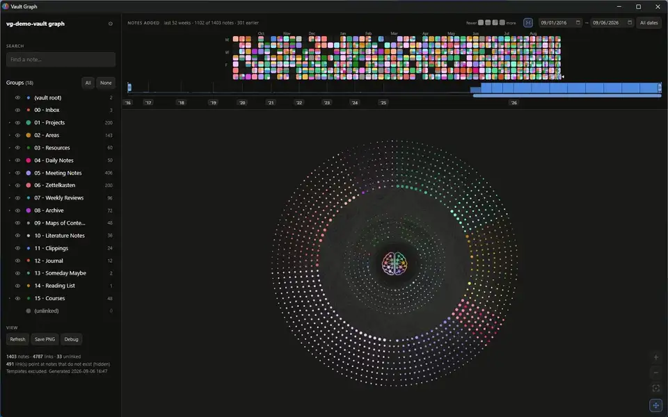
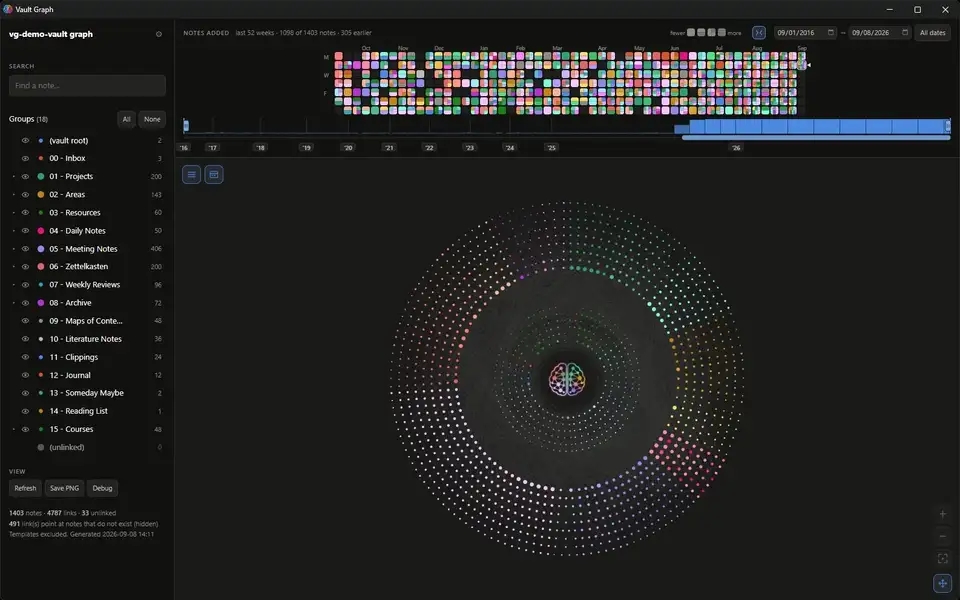
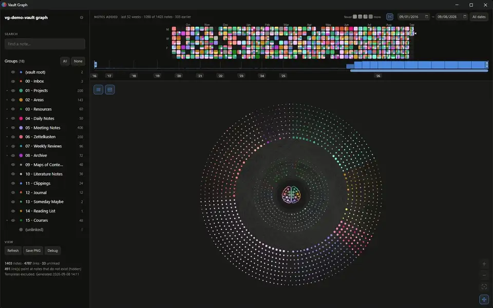
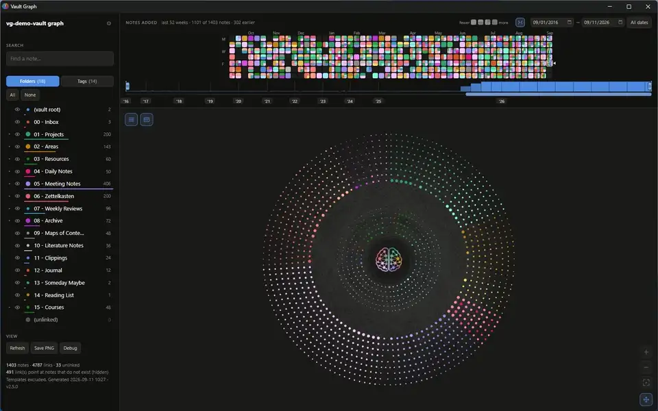
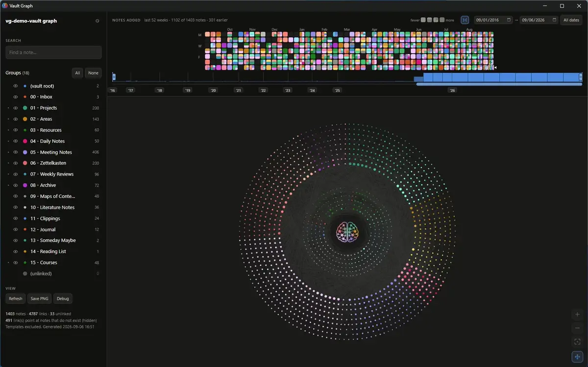
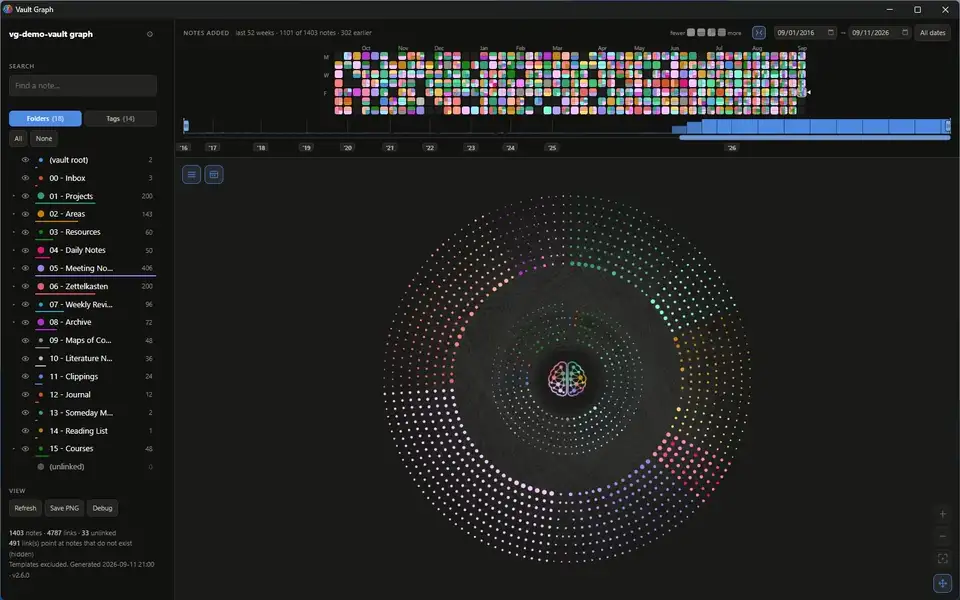
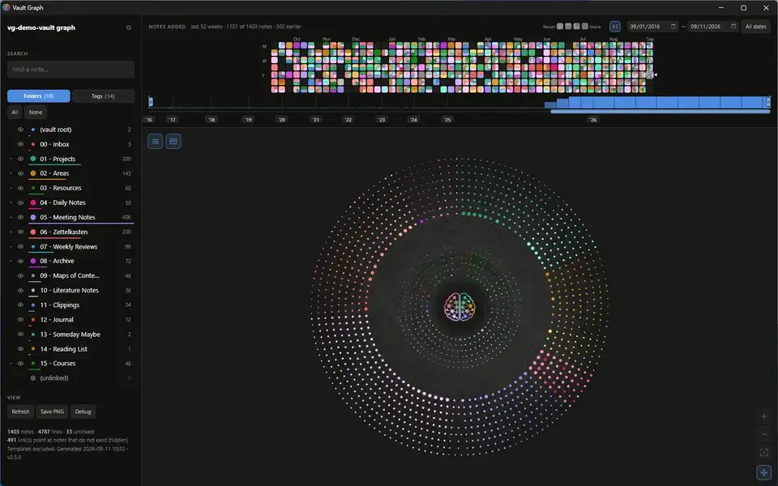

# Feature gallery

A short clip per feature — instead of one hero trying to show the whole vault at once.
[`assets/demo.webp`](../assets/demo.webp) at the top of the README is still the full
walkthrough; this page is the same page, broken into pieces small enough to actually watch.

Each entry's clip is recorded from just that feature's beats in the demo storyboard, so it
stays honest about what it's showing. The exact regeneration commands for each feature live
alongside the source, not here — see `docs/features/` if you're the one recording a clip
rather than watching one.

**Clips are added as they're recorded, not all at once.** A feature listed below with no
image yet is real and documented — just not filmed. `release.ps1` warns when a feature's
source has changed since its clip was last recorded; nothing here is regenerated on a
schedule.

---

## The disc, growing

Every note is a dot; every top-level folder owns a wedge of the circle whose angle is its
share of the vault. The layout is deterministic — no simulation, no seed — so the same
vault always draws the same picture. Refresh replays the vault growing from its first note
to now.

## Pin a note to the hub

Drag a note into the hole at the centre, right-click it, or open its own detail card and
click **Pin to hub** — three ways to hold up to thirteen notes together in the hub, out
of the ring. The ring closes around wherever a pinned note came from, and reopens the
moment it is unpinned.

## Reading one note

Hover a note to raise it and dim everything unconnected to it. Click for a panel — folder,
type, tags, word count, linked notes — each one clickable to jump across the disc.

## Filtering by folder

Click a folder in the legend to hide it; the remaining wedges grow back into the angle it
vacated and the disc re-packs. Solo a folder to hide everything else in one click.
Right-click a folder for the same "hidden by default" setting the settings panel offers —
whether it starts hidden every time the disc loads — reachable from the legend itself now,
not only from a separate panel.

## The heatmap

One square per day above the disc, coloured from what landed in it. Hover a day to halo
its notes on the disc; click to keep the mark.

## Subfolders

Open a folder's twisty to reach the subfolders inside it — tinted from the parent's hue,
hoverable and clickable the same way a top-level folder is.

## The camera

Scroll to zoom, drag to pan, double-click or the corner button to reset.

## The timeline

A strip under the heatmap band carrying every month of the vault: two handles cap the date
range, a pill sets the heatmap's own 52-week window, and a chip per year jumps straight
there. Replaced the sidebar's old rank slider — the ribbon is the only timeline now.

## Compact date axis

Years and months on the strip draw by how many notes they hold, not by the calendar. A
sparse year collapses toward the same narrow width every other sparse year gets; a busy
one keeps growing to fit what it actually holds. Off, in the gear or the icon beside the
date fields, gives every year and month back its plain calendar width.

## Folder colours

Folders are coloured from twelve slots — ten hues and two greys — handed out in folder
order and round again. Right-click a folder in the legend for the same twelve-swatch
picker at the row itself, no settings panel needed: click a slot to hold that folder to
a colour, **Auto** hands it back to its positional slot. Setting one folder never changes
another, and two folders may share a colour — useful for saying they belong together.

## Subfolder colours

The same right-click colour menu a top-level folder's row opens, reached from a
subfolder's row instead — recolour "People" inside "03 - Resources" without touching its
parent's own hue. The row only exists once its folder's twisty is open, the same
precondition the subfolders feature needs. **Auto** hands the tint back to whatever the
parent folder and position would give it anyway.

## Unlinked notes join their folder

A note with no links at all joins its own folder's group by default — same wedge, same
colour, same everything as any other note filed there. Right-click the `(unlinked)` row,
always the last one in the legend, for a second toggle — "Kept separate" — to pull unlinked
notes back into their own population instead: one flat grey swatch, its own wedge, a
parenthesised count. A third toggle, "Colour by folder", appears one row further down once
the group actually holds someone, for a note that stays in that population but still wants
its own folder's tint — the row's own swatch turns into a gradient of whatever colours are
actually in play.

