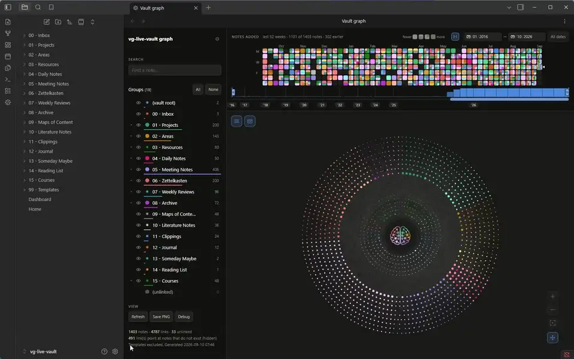
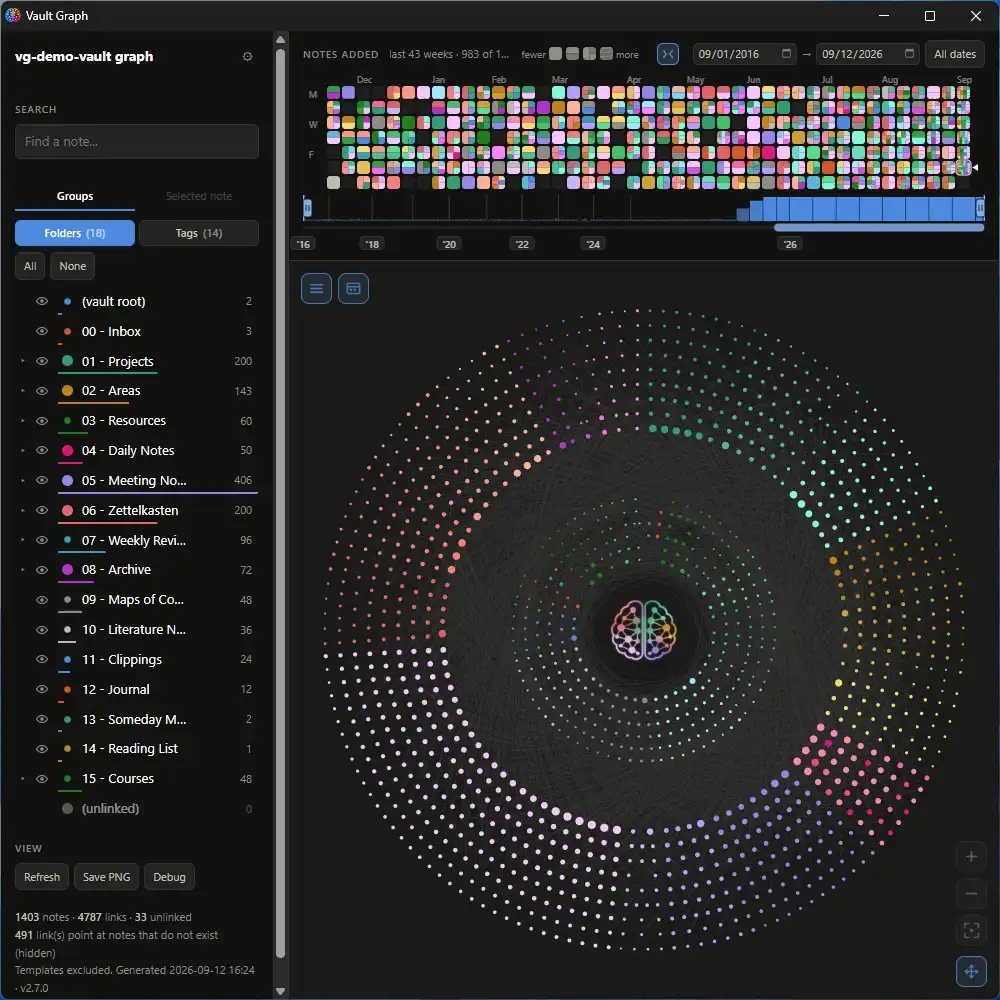

# The disc follows the vault

Write a note, and the disc takes it in: one cascade, two seconds, the new dot fading in where
its folder puts it while everything around it re-packs. Nothing is torn down, so the filters,
the date range, the pins and the camera all survive — which is what **Refresh** clears. Delete
or rename a note and the same cascade runs the other way. It is a view setting, **Follow the
vault**, on by default; with it off the graph waits for Refresh as it always did.

The clip is Obsidian itself, not the page: the graph open in one tab, a note written in a second
tab, and the first tab clicked back into view — which is when the disc moves, because a rebuild
is held while the graph is not being looked at and lands as one cascade on the way back. The
first note goes into the biggest folder, so the outer ring absorbs it; the second into a small
folder on the inner ring. Each arrival is hovered where it landed.



## On the standalone page

The exported page cannot watch a vault, so its clip is honest in a different way: the
storyboard hands the page exactly what the plugin hands it after a save — the build in hand,
one note more — and the cascade from there is the plugin's own. Same two rings, same hovers.



## Where it lives

The Obsidian take is `scripts/record-live.mjs`: it generates the demo vault, installs the built
plugin into it, launches Obsidian on a throwaway profile, enables the plugin by API (never by
clicking the trust dialog), waits for the intro sweep to finish, and then works the window with
the real Windows cursor and button (`scripts/win-input.ps1`), so a tab click is a tab click and
the hover is a hover. The notes are created through Obsidian's own vault API and typed into the
editor in chunks. What the plugin does from there is untouched.

`act: "live"` in `demoMode()` (`src/page.js`) is the page take. Two `live` beats, each followed
by a settle and a hover of the note that just arrived: the first files the note in the biggest
folder shown, so the outer ring absorbs it; the second in the biggest folder on the inner ring.
The note is `Untitled`, the way Obsidian names a fresh one, dated the newest day the disc holds
so the date range cannot hide it, and linked once to its folder's best-connected note.

**Left out of the full run on purpose.** It adds two notes, and every act after it would then be
walking a different vault from the one the intro grew.

## Regenerating this feature's clip

```powershell
node scripts/lock.mjs acquire record --owner "live clip"
node scripts/record-live.mjs --monitor right
# wrote demo-obsidian-live-<timestamp>.mp4
node scripts/lock.mjs release record --owner "live clip"

.\scripts\make-hero.ps1 -In demo-obsidian-live-<timestamp>.mp4 -Out assets\features\live.webp
```

And the page take, the same way every other feature is filmed:

```powershell
.\scripts\record-demo.ps1 -Act live -Monitor right
# wrote demo-live-<timestamp>.mp4

.\scripts\make-hero.ps1 -In demo-live-<timestamp>.mp4 -Out assets\features\live-page.webp
```

Commit both clips and update `Last re-recorded` below in the same commit — that's what
`release.ps1`'s staleness check reads.

## Metadata

| | |
|---|---|
| **Introduced in** | `2.4.0 (github#72)` |
| **Last re-recorded** | `2.5.0 — 2026-09-11` — Obsidian: 34.5 s at 1600x1000, encoded at 960 px (0.56 MB); page: 11.9 s at 1586x992, encoded at 960 px (0.41 MB) |
